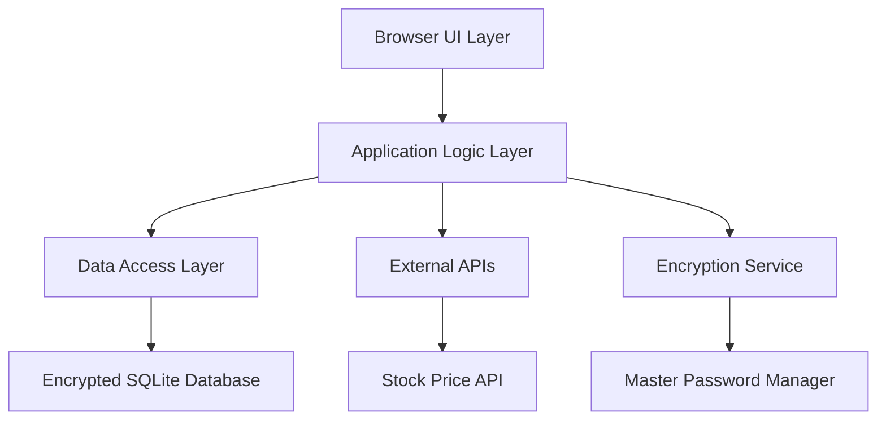

# Design Document

## Overview

The Networth Tracker is a browser-based single-page application (SPA) built with modern web technologies that provides secure, offline-first financial portfolio management. The application uses an encrypted SQLite database for local storage, implements a tabbed interface for different investment types, and integrates with external APIs for real-time stock price updates while maintaining complete data privacy.

## Architecture

### High-Level Architecture



### Technology Stack

- **Backend Framework**: Flask with Python for server-side logic and API endpoints
- **Frontend**: HTML5, CSS3, and vanilla JavaScript for lightweight browser interface
- **Database**: SQLite with Python sqlite3 module for local file storage
- **Encryption**: Python cryptography library with Fernet (AES-128) encryption
- **Web Server**: Flask development server for local hosting
- **Styling**: Bootstrap CSS framework for responsive design
- **Stock API**: yfinance Python library for free stock price data

### Data Flow

1. Flask application starts local web server (localhost:5000)
2. User accesses application through browser
3. Authentication via master password through Flask routes
4. Database operations handled by Python SQLite with encryption
5. Stock price updates via yfinance library API calls
6. Historical data snapshots stored on value changes
7. Export/import functionality with encrypted JSON backups

## Components and Interfaces

### Core Components

#### 1. Authentication Module
```python
class AuthenticationManager:
    def __init__(self, db_path: str):
        self.db_path = db_path
        self.session_key = None

    def set_master_password(self, password: str) -> bool:
        """Set initial master password"""
        pass

    def verify_password(self, password: str) -> bool:
        """Verify master password and create session"""
        pass

    def derive_encryption_key(self, password: str) -> bytes:
        """Derive encryption key from password"""
        pass
```

#### 2. Account Management Module
```python
from dataclasses import dataclass
from typing import List, Optional
from datetime import date, datetime

@dataclass
class BaseAccount:
    id: str
    name: str
    institution: str
    account_type: str
    created_date: datetime
    last_updated: datetime

@dataclass
class CDAccount(BaseAccount):
    principal_amount: float
    interest_rate: float
    maturity_date: date
    current_value: float

@dataclass
class StockPosition:
    symbol: str
    shares: float
    purchase_price: float
    purchase_date: date
    current_price: Optional[float] = None
    last_updated: Optional[datetime] = None
```

#### 3. Database Service Module
```python
class DatabaseService:
    def __init__(self, db_path: str, encryption_key: bytes):
        self.db_path = db_path
        self.encryption_key = encryption_key
        self.connection = None

    def create_account(self, account: BaseAccount) -> str:
        """Create new account and return ID"""
        pass

    def get_accounts(self) -> List[BaseAccount]:
        """Retrieve all accounts"""
        pass

    def update_account(self, account: BaseAccount) -> None:
        """Update existing account"""
        pass
```

#### 4. Stock Price Service Module
```python
import yfinance as yf
from typing import Dict, List

class StockPriceService:
    def __init__(self):
        self.last_update = None
        self.rate_limit_delay = 1  # seconds between requests

    def get_current_price(self, symbol: str) -> float:
        """Get current stock price for symbol"""
        ticker = yf.Ticker(symbol)
        return ticker.history(period="1d")['Close'].iloc[-1]

    def get_batch_prices(self, symbols: List[str]) -> Dict[str, float]:
        """Get current prices for multiple symbols"""
        pass
```

### Flask Routes and API Endpoints

#### 1. Authentication Routes
```python
@app.route('/login', methods=['GET', 'POST'])
def login():
    """Handle master password authentication"""
    pass

@app.route('/logout', methods=['POST'])
def logout():
    """Clear session and logout user"""
    pass

@app.route('/setup', methods=['GET', 'POST'])
def setup():
    """Initial setup for master password"""
    pass
```

#### 2. Account Management Routes
```python
@app.route('/api/accounts', methods=['GET'])
def get_accounts():
    """Get all accounts for dashboard"""
    pass

@app.route('/api/accounts', methods=['POST'])
def create_account():
    """Create new account"""
    pass

@app.route('/api/accounts/<account_id>', methods=['PUT'])
def update_account(account_id):
    """Update existing account"""
    pass

@app.route('/api/accounts/<account_id>', methods=['DELETE'])
def delete_account(account_id):
    """Delete account"""
    pass
```

#### 3. Stock Management Routes
```python
@app.route('/api/stocks/prices', methods=['POST'])
def update_stock_prices():
    """Update stock prices for all positions"""
    pass

@app.route('/api/accounts/<account_id>/positions', methods=['POST'])
def add_stock_position(account_id):
    """Add stock position to trading account"""
    pass
```

#### 4. Data Export/Import Routes
```python
@app.route('/api/export', methods=['GET'])
def export_data():
    """Export encrypted backup"""
    pass

@app.route('/api/import', methods=['POST'])
def import_data():
    """Import from encrypted backup"""
    pass
```

### Python Service Classes

#### 1. Encryption Service
```python
from cryptography.fernet import Fernet
from cryptography.hazmat.primitives import hashes
from cryptography.hazmat.primitives.kdf.pbkdf2 import PBKDF2HMAC
import base64
import os

class EncryptionService:
    def __init__(self):
        self.salt = None
        self.key = None

    def derive_key(self, password: str, salt: bytes = None) -> bytes:
        """Derive encryption key from password"""
        if salt is None:
            salt = os.urandom(16)
        self.salt = salt

        kdf = PBKDF2HMAC(
            algorithm=hashes.SHA256(),
            length=32,
            salt=salt,
            iterations=100000,
        )
        key = base64.urlsafe_b64encode(kdf.derive(password.encode()))
        self.key = key
        return key

    def encrypt(self, data: str) -> bytes:
        """Encrypt data using Fernet"""
        f = Fernet(self.key)
        return f.encrypt(data.encode())

    def decrypt(self, encrypted_data: bytes) -> str:
        """Decrypt data using Fernet"""
        f = Fernet(self.key)
        return f.decrypt(encrypted_data).decode()
```

## Data Models

### Python Data Models

```python
from dataclasses import dataclass, asdict
from typing import List, Optional, Dict, Any
from datetime import date, datetime
from enum import Enum
import json

class AccountType(Enum):
    CD = "CD"
    SAVINGS = "SAVINGS"
    ACCOUNT_401K = "401K"
    TRADING = "TRADING"
    I_BONDS = "I_BONDS"
    # Future investment types can be added here without breaking existing data

class ChangeType(Enum):
    MANUAL_UPDATE = "MANUAL_UPDATE"
    STOCK_PRICE_UPDATE = "STOCK_PRICE_UPDATE"
    INITIAL_ENTRY = "INITIAL_ENTRY"

@dataclass
class BaseAccount:
    id: str
    name: str
    institution: str
    account_type: AccountType
    created_date: datetime
    last_updated: datetime
    # Flexible metadata field for future investment product attributes
    metadata: Optional[Dict[str, Any]] = None

    def to_dict(self) -> Dict[str, Any]:
        return asdict(self)

@dataclass
class CDAccount(BaseAccount):
    principal_amount: float
    interest_rate: float
    maturity_date: date
    current_value: float

@dataclass
class SavingsAccount(BaseAccount):
    current_balance: float
    interest_rate: float

@dataclass
class Account401k(BaseAccount):
    current_balance: float
    employer_match: float
    contribution_limit: float
    employer_contribution: float

@dataclass
class StockPosition:
    symbol: str
    shares: float
    purchase_price: float
    purchase_date: date
    current_price: Optional[float] = None
    last_updated: Optional[datetime] = None

@dataclass
class IBondsAccount(BaseAccount):
    purchase_amount: float
    purchase_date: date
    current_value: float
    fixed_rate: float
    inflation_rate: float
    maturity_date: date  # 30 years from purchase

@dataclass
class TradingAccount(BaseAccount):
    broker_name: str  # Support multiple brokers
    cash_balance: float
    positions: List[StockPosition]

@dataclass
class HistoricalSnapshot:
    id: str
    account_id: str
    timestamp: datetime
    value: float
    change_type: ChangeType
    metadata: Optional[Dict[str, Any]] = None
```

### Database Schema

```sql
-- Accounts table with flexible schema for future investment types
CREATE TABLE accounts (
  id TEXT PRIMARY KEY,
  name TEXT NOT NULL,
  institution TEXT NOT NULL,
  type TEXT NOT NULL,
  encrypted_data BLOB NOT NULL,  -- JSON with all account-specific fields
  created_date INTEGER NOT NULL,
  last_updated INTEGER NOT NULL,
  schema_version INTEGER DEFAULT 1  -- For future migrations
);

-- Historical snapshots table
CREATE TABLE historical_snapshots (
  id TEXT PRIMARY KEY,
  account_id TEXT NOT NULL,
  timestamp INTEGER NOT NULL,
  value REAL NOT NULL,
  change_type TEXT NOT NULL,
  encrypted_metadata BLOB,
  FOREIGN KEY (account_id) REFERENCES accounts (id)
);

-- Stock positions table
CREATE TABLE stock_positions (
  id TEXT PRIMARY KEY,
  trading_account_id TEXT NOT NULL,
  symbol TEXT NOT NULL,
  shares REAL NOT NULL,
  purchase_price REAL NOT NULL,
  purchase_date INTEGER NOT NULL,
  current_price REAL,
  last_price_update INTEGER,
  FOREIGN KEY (trading_account_id) REFERENCES accounts (id)
);

-- Application settings table
CREATE TABLE app_settings (
  key TEXT PRIMARY KEY,
  encrypted_value BLOB NOT NULL
);
```

## Error Handling

### Error Categories

1. **Authentication Errors**
   - Invalid master password
   - Password derivation failures
   - Session timeout

2. **Database Errors**
   - Encryption/decryption failures
   - Data corruption
   - Storage quota exceeded

3. **Network Errors**
   - Stock API rate limiting
   - API service unavailable
   - Network connectivity issues

4. **Validation Errors**
   - Invalid account data
   - Negative values
   - Future dates for historical data

### Error Handling Strategy

```typescript
interface AppError {
  type: ErrorType;
  message: string;
  code: string;
  recoverable: boolean;
  userAction?: string;
}

enum ErrorType {
  AUTHENTICATION = 'AUTHENTICATION',
  DATABASE = 'DATABASE',
  NETWORK = 'NETWORK',
  VALIDATION = 'VALIDATION',
  ENCRYPTION = 'ENCRYPTION'
}

class ErrorHandler {
  static handle(error: AppError): void {
    // Log error for debugging
    console.error(`[${error.type}] ${error.code}: ${error.message}`);

    // Show user-friendly message
    if (error.recoverable) {
      showNotification(error.message, 'error');
      if (error.userAction) {
        showActionButton(error.userAction);
      }
    } else {
      showCriticalError(error.message);
    }
  }
}
```

## Testing Strategy

### Unit Testing
- **Flask Routes**: pytest for testing API endpoints and route handlers
- **Service Classes**: pytest for business logic and data operations
- **Utilities**: Pure function testing for calculations and validations
- **Coverage Target**: 90% code coverage using pytest-cov

### Integration Testing
- **Database Operations**: Test encrypted CRUD operations with SQLite
- **Stock API Integration**: Mock yfinance API calls for testing
- **Authentication Flow**: End-to-end password and encryption testing
- **Data Import/Export**: Backup and restore functionality testing

### End-to-End Testing
- **User Workflows**: Selenium for complete user journeys through browser
- **Cross-browser Testing**: Chrome, Firefox compatibility testing
- **Responsive Design**: Mobile and desktop layouts validation
- **Performance Testing**: Large dataset handling with 1000+ accounts

### Security Testing
- **Encryption Validation**: Verify data is properly encrypted in SQLite database
- **Password Security**: Test PBKDF2 key derivation and storage
- **Data Leakage**: Ensure no plaintext data in database files
- **API Security**: Validate only stock symbols sent to yfinance, no financial data

### Test Data Strategy
```python
class TestDataFactory:
    @staticmethod
    def create_cd_account(**overrides) -> CDAccount:
        """Create test CD account with optional overrides"""
        defaults = {
            'id': 'test-cd-1',
            'name': 'Test CD',
            'institution': 'Test Bank',
            'account_type': AccountType.CD,
            'created_date': datetime.now(),
            'last_updated': datetime.now(),
            'principal_amount': 10000.0,
            'interest_rate': 2.5,
            'maturity_date': date(2025, 12, 31),
            'current_value': 10250.0
        }
        defaults.update(overrides)
        return CDAccount(**defaults)

    @staticmethod
    def create_trading_account(position_count: int = 0) -> TradingAccount:
        """Create test trading account with optional stock positions"""
        positions = []
        for i in range(position_count):
            positions.append(StockPosition(
                symbol=f'TEST{i}',
                shares=100.0,
                purchase_price=50.0,
                purchase_date=date.today()
            ))

        return TradingAccount(
            id='test-trading-1',
            name='Test Trading',
            institution='Test Broker',
            account_type=AccountType.TRADING,
            created_date=datetime.now(),
            last_updated=datetime.now(),
            cash_balance=5000.0,
            positions=positions
        )
```

### Performance Testing
- **Database Performance**: Test with 1000+ accounts and 10,000+ historical records
- **Stock Price Updates**: Batch processing of 50+ stock symbols
- **UI Responsiveness**: Ensure smooth interactions with large datasets
- **Memory Usage**: Monitor for memory leaks during extended use

## Security Considerations

### Encryption Implementation
- **Algorithm**: AES-256-GCM for authenticated encryption
- **Key Derivation**: PBKDF2 with 100,000 iterations and random salt
- **Data Protection**: All sensitive data encrypted before database storage
- **Memory Security**: Clear sensitive data from memory after use

### Password Management
- **Master Password**: Required for application access
- **Password Strength**: Minimum 12 characters with complexity requirements
- **Session Management**: Auto-lock after inactivity
- **Password Recovery**: No recovery mechanism to maintain security

### Data Privacy
- **Local Storage Only**: No cloud synchronization or external data transmission
- **API Isolation**: Only stock symbols sent to external APIs, no financial data
- **Browser Security**: Utilize secure browser APIs and CSP headers
- **Data Minimization**: Store only necessary data for functionality
## Error Ha
ndling

### Error Categories

1. **Authentication Errors**
   - Invalid master password
   - Password derivation failures
   - Session timeout

2. **Database Errors**
   - Encryption/decryption failures
   - Data corruption
   - Storage quota exceeded

3. **Network Errors**
   - Stock API rate limiting
   - API service unavailable
   - Network connectivity issues

4. **Validation Errors**
   - Invalid account data
   - Negative values
   - Future dates for historical data

### Python Error Handling Strategy

```python
from enum import Enum
from dataclasses import dataclass
from typing import Optional
import logging

class ErrorType(Enum):
    AUTHENTICATION = "AUTHENTICATION"
    DATABASE = "DATABASE"
    NETWORK = "NETWORK"
    VALIDATION = "VALIDATION"
    ENCRYPTION = "ENCRYPTION"

@dataclass
class AppError(Exception):
    error_type: ErrorType
    message: str
    code: str
    recoverable: bool
    user_action: Optional[str] = None

class ErrorHandler:
    @staticmethod
    def handle_error(error: AppError) -> dict:
        """Handle application errors and return JSON response"""
        # Log error for debugging
        logging.error(f"[{error.error_type.value}] {error.code}: {error.message}")

        # Return structured error response
        response = {
            'error': True,
            'type': error.error_type.value,
            'message': error.message,
            'code': error.code,
            'recoverable': error.recoverable
        }

        if error.user_action:
            response['user_action'] = error.user_action

        return response

# Custom exception classes
class AuthenticationError(AppError):
    def __init__(self, message: str, code: str = "AUTH_001"):
        super().__init__(ErrorType.AUTHENTICATION, message, code, True)

class DatabaseError(AppError):
    def __init__(self, message: str, code: str = "DB_001"):
        super().__init__(ErrorType.DATABASE, message, code, False)

class ValidationError(AppError):
    def __init__(self, message: str, code: str = "VAL_001"):
        super().__init__(ErrorType.VALIDATION, message, code, True)
```

## Security Considerations

### Encryption Implementation
- **Algorithm**: Fernet (AES-128) for symmetric encryption with authentication
- **Key Derivation**: PBKDF2 with 100,000 iterations and random salt
- **Data Protection**: All sensitive account data encrypted before SQLite storage
- **Memory Security**: Clear sensitive data from Python variables after use

### Password Management
- **Master Password**: Required for Flask application access
- **Password Strength**: Minimum 12 characters with complexity requirements
- **Session Management**: Flask sessions with timeout after inactivity
- **Password Recovery**: No recovery mechanism to maintain security

### Data Privacy
- **Local Storage Only**: SQLite database stored locally, no cloud synchronization
- **API Isolation**: Only stock symbols sent to yfinance, no financial data transmitted
- **Local Server**: Flask runs on localhost only, not accessible from network
- **Data Minimization**: Store only necessary data for portfolio tracking functionality

### Application Security
```python
# Flask security configuration
from datetime import timedelta
import os

app.config['SECRET_KEY'] = os.urandom(24)  # Random session key
app.config['SESSION_COOKIE_SECURE'] = False  # HTTP for localhost
app.config['SESSION_COOKIE_HTTPONLY'] = True  # No JavaScript access
app.config['PERMANENT_SESSION_LIFETIME'] = timedelta(hours=2)  # Session timeout

# Database file permissions (Unix/Linux/macOS)
if os.name != 'nt':  # Not Windows
    os.chmod('networth.db', 0o600)  # Owner read/write only
```

## Flexible Architecture for Future Investment Products

### Extensibility Design Principles

1. **Account Type Registry**: Dynamic registration of new investment types
2. **Metadata Storage**: JSON-based flexible attributes for each account type
3. **Schema Versioning**: Database migration support for new fields
4. **Plugin Architecture**: Modular account type handlers

### Account Type Factory Pattern
```python
class AccountFactory:
    _account_types = {
        AccountType.CD: CDAccount,
        AccountType.SAVINGS: SavingsAccount,
        AccountType.ACCOUNT_401K: Account401k,
        AccountType.TRADING: TradingAccount,
        AccountType.I_BONDS: IBondsAccount,
    }

    @classmethod
    def register_account_type(cls, account_type: AccountType, account_class):
        """Register new investment product types dynamically"""
        cls._account_types[account_type] = account_class

    @classmethod
    def create_account(cls, account_type: AccountType, **kwargs) -> BaseAccount:
        """Factory method to create accounts of any registered type"""
        if account_type not in cls._account_types:
            raise ValueError(f"Unknown account type: {account_type}")
        return cls._account_types[account_type](**kwargs)
```

### Database Migration System
```python
class DatabaseMigration:
    def __init__(self, db_service):
        self.db_service = db_service
        self.current_version = 1

    def migrate_to_version(self, target_version: int):
        """Handle database schema migrations for new investment types"""
        migrations = {
            2: self._add_i_bonds_support,
            3: self._add_metadata_column,
            # Future migrations can be added here
        }

        for version in range(self.current_version + 1, target_version + 1):
            if version in migrations:
                migrations[version]()
                self._update_schema_version(version)
```

### Multi-Broker Trading Support
```python
@dataclass
class TradingAccount(BaseAccount):
    broker_name: str  # "Fidelity", "Charles Schwab", "E*TRADE", etc.
    account_number: str  # Encrypted account identifier
    cash_balance: float
    positions: List[StockPosition]

    def get_broker_specific_data(self) -> Dict[str, Any]:
        """Return broker-specific metadata from flexible metadata field"""
        return self.metadata.get('broker_data', {}) if self.metadata else {}
```

### Project Structure
```
networth-tracker/
├── app.py                 # Main Flask application
├── models/
│   ├── __init__.py
│   ├── accounts.py        # Account data models
│   ├── historical.py     # Historical data models
│   └── account_factory.py # Extensible account creation
├── services/
│   ├── __init__.py
│   ├── database.py        # Database operations
│   ├── encryption.py     # Encryption service
│   ├── stock_prices.py   # Stock price service
│   ├── auth.py           # Authentication service
│   └── migration.py      # Database migration service
├── account_types/         # Modular account type handlers
│   ├── __init__.py
│   ├── cd_handler.py
│   ├── savings_handler.py
│   ├── trading_handler.py
│   └── ibonds_handler.py
├── static/
│   ├── css/
│   │   └── styles.css    # Application styles
│   └── js/
│       └── app.js        # Frontend JavaScript
├── templates/
│   ├── base.html         # Base template
│   ├── login.html        # Login page
│   ├── dashboard.html    # Main dashboard
│   └── accounts/         # Account management templates
│       ├── cd_form.html
│       ├── trading_form.html
│       └── ibonds_form.html
├── tests/
│   ├── test_models.py
│   ├── test_services.py
│   ├── test_routes.py
│   └── test_migrations.py
├── requirements.txt      # Python dependencies
└── README.md            # Project documentation
```
#
# Demo Mode Implementation

### Demo Mode Architecture
```python
from enum import Enum
import random
from datetime import datetime, timedelta, date

class ApplicationMode(Enum):
    PRODUCTION = "production"
    DEMO = "demo"

class DemoDataGenerator:
    """Generate realistic synthetic financial data for demo mode"""

    def __init__(self):
        self.demo_institutions = [
            "Chase Bank", "Bank of America", "Wells Fargo", "Citi Bank",
            "Capital One", "Ally Bank", "Marcus by Goldman Sachs"
        ]
        self.demo_brokers = [
            "Fidelity", "Charles Schwab", "E*TRADE", "TD Ameritrade",
            "Robinhood", "Interactive Brokers"
        ]
        self.demo_stocks = [
            ("AAPL", "Apple Inc.", 150.0),
            ("GOOGL", "Alphabet Inc.", 2500.0),
            ("MSFT", "Microsoft Corp.", 300.0),
            ("AMZN", "Amazon.com Inc.", 3200.0),
            ("TSLA", "Tesla Inc.", 800.0),
            ("NVDA", "NVIDIA Corp.", 400.0),
            ("META", "Meta Platforms", 200.0),
            ("NFLX", "Netflix Inc.", 400.0)
        ]

    def generate_demo_accounts(self) -> List[BaseAccount]:
        """Generate complete set of demo accounts with realistic data"""
        accounts = []
        accounts.extend(self._generate_cd_accounts(3))
        accounts.extend(self._generate_savings_accounts(2))
        accounts.extend(self._generate_401k_accounts(1))
        accounts.extend(self._generate_trading_accounts(2))
        accounts.extend(self._generate_ibonds_accounts(2))
        return accounts

    def _generate_cd_accounts(self, count: int) -> List[CDAccount]:
        """Generate sample CD accounts"""
        accounts = []
        for i in range(count):
            maturity_months = random.choice([6, 12, 18, 24, 36, 60])
            principal = random.randint(5000, 50000)
            rate = round(random.uniform(1.5, 4.5), 2)

            accounts.append(CDAccount(
                id=f"demo-cd-{i+1}",
                name=f"CD Account {i+1}",
                institution=random.choice(self.demo_institutions),
                account_type=AccountType.CD,
                created_date=datetime.now() - timedelta(days=random.randint(30, 365)),
                last_updated=datetime.now(),
                principal_amount=principal,
                interest_rate=rate,
                maturity_date=date.today() + timedelta(days=maturity_months * 30),
                current_value=principal * (1 + rate/100 * maturity_months/12)
            ))
        return accounts

    def _generate_trading_accounts(self, count: int) -> List[TradingAccount]:
        """Generate sample trading accounts with stock positions"""
        accounts = []
        for i in range(count):
            positions = []
            num_positions = random.randint(3, 8)

            for j in range(num_positions):
                symbol, name, current_price = random.choice(self.demo_stocks)
                shares = random.randint(10, 200)
                purchase_price = current_price * random.uniform(0.7, 1.3)

                positions.append(StockPosition(
                    symbol=symbol,
                    shares=shares,
                    purchase_price=round(purchase_price, 2),
                    purchase_date=date.today() - timedelta(days=random.randint(30, 730)),
                    current_price=current_price,
                    last_updated=datetime.now()
                ))

            accounts.append(TradingAccount(
                id=f"demo-trading-{i+1}",
                name=f"Trading Account {i+1}",
                institution=random.choice(self.demo_brokers),
                account_type=AccountType.TRADING,
                created_date=datetime.now() - timedelta(days=random.randint(30, 365)),
                last_updated=datetime.now(),
                broker_name=random.choice(self.demo_brokers),
                cash_balance=random.randint(1000, 10000),
                positions=positions
            ))
        return accounts

    def generate_historical_data(self, accounts: List[BaseAccount]) -> List[HistoricalSnapshot]:
        """Generate 2 years of historical performance data"""
        snapshots = []
        for account in accounts:
            snapshots.extend(self._generate_account_history(account))
        return snapshots

    def _generate_account_history(self, account: BaseAccount) -> List[HistoricalSnapshot]:
        """Generate monthly historical snapshots for an account"""
        snapshots = []
        start_date = datetime.now() - timedelta(days=730)  # 2 years ago
        current_date = start_date

        base_value = self._get_account_base_value(account)

        while current_date <= datetime.now():
            # Simulate monthly value changes
            variation = random.uniform(-0.05, 0.08)  # -5% to +8% monthly change
            value = base_value * (1 + variation)

            snapshots.append(HistoricalSnapshot(
                id=f"demo-hist-{account.id}-{current_date.strftime('%Y%m')}",
                account_id=account.id,
                timestamp=current_date,
                value=round(value, 2),
                change_type=ChangeType.MANUAL_UPDATE
            ))

            current_date += timedelta(days=30)
            base_value = value  # Use previous value as base for next month

        return snapshots

class ApplicationController:
    def __init__(self):
        self.mode = ApplicationMode.PRODUCTION
        self.db_service = None

    def set_mode(self, mode: ApplicationMode):
        """Switch between production and demo modes"""
        self.mode = mode
        self.db_service = DatabaseService(mode)

        if mode == ApplicationMode.DEMO:
            self._initialize_demo_mode()

    def _initialize_demo_mode(self):
        """Initialize demo database with synthetic data"""
        # Check if demo database already exists
        if not self.db_service.database_exists():
            generator = DemoDataGenerator()
            demo_accounts = generator.generate_demo_accounts()
            demo_history = generator.generate_historical_data(demo_accounts)

            # Populate demo database
            for account in demo_accounts:
                self.db_service.create_account(account)

            for snapshot in demo_history:
                self.db_service.create_historical_snapshot(snapshot)
```

### Flask Routes for Demo Mode
```python
@app.route('/mode', methods=['GET', 'POST'])
def application_mode():
    """Handle switching between production and demo modes"""
    if request.method == 'POST':
        mode = request.form.get('mode')
        if mode in ['production', 'demo']:
            session['app_mode'] = mode
            app_controller.set_mode(ApplicationMode(mode))
            flash(f'Switched to {mode} mode', 'success')
        return redirect(url_for('dashboard'))

    return render_template('mode_selection.html',
                         current_mode=session.get('app_mode', 'production'))

@app.route('/demo/reset', methods=['POST'])
def reset_demo_data():
    """Reset demo database with fresh synthetic data"""
    if session.get('app_mode') != 'demo':
        flash('Demo reset only available in demo mode', 'error')
        return redirect(url_for('dashboard'))

    # Clear existing demo data and regenerate
    app_controller.db_service.clear_all_data()
    app_controller._initialize_demo_mode()
    flash('Demo data has been reset with new synthetic data', 'success')
    return redirect(url_for('dashboard'))
```

### Demo Mode UI Indicators
```html
<!-- Mode indicator banner -->

<div class="alert alert-info demo-banner">
    <strong>DEMO MODE</strong> - You are viewing synthetic data for demonstration purposes.
    <a href="{{ url_for('application_mode') }}" class="btn btn-sm btn-outline-primary">
        Switch to Production
    </a>
    <a href="{{ url_for('reset_demo_data') }}" class="btn btn-sm btn-outline-secondary">
        Reset Demo Data
    </a>
</div>

```

This demo mode implementation provides:

1. **Separate Database**: Complete isolation between demo and production data
2. **Realistic Synthetic Data**: Accounts across all investment types with realistic values
3. **Historical Performance**: 2 years of monthly historical data for trend analysis
4. **Easy Mode Switching**: Simple interface to switch between demo and production
5. **Demo Data Reset**: Ability to generate fresh demo data for testing
6. **Clear UI Indicators**: Visual cues when in demo mode to prevent confusion