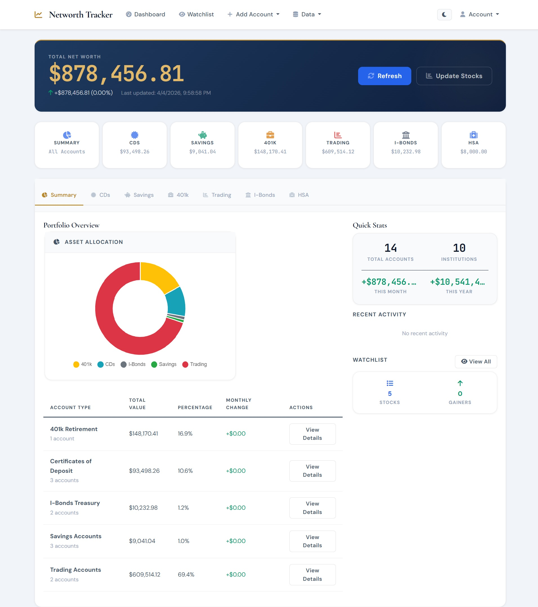

# Net Worth Tracker

A secure, privacy-first financial portfolio management application that runs locally on your machine. Track your investments across multiple account types with military-grade encryption and complete data privacy.

## 🚀 Quick Start

```bash
# Clone or download the application
git clone <repository-url> networth-tracker
cd networth-tracker

# Set up and start (automated)
./scripts/start.sh  # macOS/Linux
scripts\start.bat   # Windows

# Or manually
python3 -m venv venv
source venv/bin/activate  # macOS/Linux: venv\Scripts\activate on Windows
./venv/bin/pip install -r requirements.txt
./venv/bin/python scripts/start.py
```

Open your browser to `http://127.0.0.1:5000`

## ✨ Key Features

### 🔒 **Privacy & Security First**
- **Local-only storage** - Your data never leaves your computer
- **Military-grade encryption** - AES-256 encryption for all financial data
- **No cloud dependencies** - Works completely offline
- **Zero data collection** - No analytics, tracking, or telemetry

### 💼 **Comprehensive Portfolio Tracking**
- **Multiple Account Types**: CDs, Savings, 401k, Trading, I-bonds, HSA
- **Real-time Stock Prices** - Automatic updates for trading accounts via yfinance
- **Historical Performance** - Track your portfolio growth over time with automated snapshots
- **Multi-broker Support** - Manage accounts across different institutions
- **Stock Watchlist** - Monitor stocks without owning them

### 🛠 **User-Friendly Features**
- **Demo Database** - Import realistic synthetic data to explore features
- **Export/Import** - Encrypted backups for data portability
- **Cross-platform** - Windows, macOS, and Linux support
- **Browser-based** - Clean, responsive web interface
- **Comprehensive Error Handling** - User-friendly error messages and recovery
- **Flexible Configuration** - Environment-specific settings (development, production, testing)

## 📸 Dashboard Preview



*The main dashboard provides a comprehensive overview of your portfolio with real-time account summaries, asset allocation charts, and quick stats. The clean, responsive interface makes it easy to track your financial progress across all account types.*

## 📚 Documentation

### Getting Started
- **[Installation Guide](docs/installation.md)** - Step-by-step setup for all platforms
- **[Quick Start Guide](docs/quick-start.md)** - Get running in 5 minutes
- **[User Guide](docs/user-guide.md)** - Complete feature documentation
- **[Demo Database Guide](docs/demo-data.md)** - Explore features with synthetic data

### Configuration & Deployment
- **[Configuration Reference](docs/configuration.md)** - Detailed configuration options
- **[Deployment Guide](docs/deployment.md)** - Production deployment and setup
- **[Security Guide](docs/security.md)** - Security best practices

### Support & Troubleshooting
- **[FAQ](docs/faq.md)** - Frequently asked questions
- **[Troubleshooting Guide](docs/troubleshooting.md)** - Common issues and solutions
- **[Scripts Documentation](docs/scripts/README.md)** - Startup and utility scripts

## 🏗 Project Structure

```
networth-tracker/
├── app.py                 # Main Flask application entry point
├── config.py              # Configuration management (environments, settings)
├── requirements.txt       # Python dependencies
├── scripts/               # Startup and utility scripts
│   ├── start.py          # Main startup script with environment detection
│   ├── start.sh          # Unix/Linux/macOS launcher
│   ├── start.bat         # Windows launcher
│   ├── init_db.py        # Database initialization
│   └── generate_demo_database.py # Demo data generation
├── models/               # Data models and account types
│   └── accounts.py       # Account models, enums, factory patterns
├── services/             # Business logic services
│   ├── auth.py           # Authentication and session management
│   ├── database.py       # Encrypted SQLite operations
│   ├── encryption.py     # AES-256 encryption service
│   ├── historical.py     # Historical data tracking
│   ├── stock_prices.py   # Real-time stock price fetching
│   ├── export_import.py  # Data backup/restore
│   ├── error_handler.py  # Centralized error handling
│   ├── logging_config.py # Logging configuration
│   └── watchlist.py      # Stock watchlist management
├── templates/            # Jinja2 HTML templates
├── static/              # CSS, JavaScript, and assets
├── docs/                # Comprehensive documentation
├── tests/               # Test suites with integration tests
├── logs/                # Application logs (secure permissions)
├── backups/             # Encrypted data backups
└── data/                # Database files location
```

## 🔧 System Requirements

### Minimum Requirements
- **Python**: 3.8 or higher
- **RAM**: 512 MB available memory
- **Storage**: 100 MB free disk space
- **OS**: Windows 10+, macOS 10.14+, Linux (Ubuntu 18.04+)
- **Network**: Internet connection for stock price updates (optional)

### Recommended
- **Python**: 3.9 or higher
- **RAM**: 1 GB available memory
- **Storage**: 500 MB free disk space (for data and backups)
- **Browser**: Modern web browser (Chrome, Firefox, Safari, Edge)

## 🛡 Security Features

### Data Protection
- **AES-256 Encryption**: All financial data encrypted at rest
- **PBKDF2 Key Derivation**: 100,000 iterations with random salt
- **Master Password**: Single password protects all your data
- **Secure File Permissions**: Database files protected at OS level

### Privacy Guarantees
- **No Cloud Storage**: All data remains on your local machine
- **No External Transmission**: Only stock symbols sent to APIs (no financial data)
- **No Analytics**: Zero telemetry or usage tracking
- **Open Architecture**: Code can be audited for security

### Network Security
- **Localhost Only**: Application binds to 127.0.0.1 only
- **No Remote Access**: Cannot be accessed from other machines
- **Minimal API Usage**: Only stock price lookups via yfinance (symbols only)
- **Rate Limited**: Stock API calls are rate-limited to prevent abuse

## 🎯 Supported Account Types

| Account Type | Features |
|--------------|----------|
| **Certificate of Deposit (CD)** | Principal, interest rate, maturity tracking |
| **Savings Accounts** | Balance tracking, interest monitoring |
| **401k Retirement** | Balance, employer match, contribution limits |
| **Trading Accounts** | Stock positions, real-time prices, multi-broker support |
| **I-bonds** | Purchase amount, inflation adjustments, maturity tracking |
| **HSA (Health Savings Account)** | Contribution limits, employer contributions, investment tracking |

## 🏛 Technical Architecture

### Core Technologies
- **Backend**: Python 3.8+ with Flask web framework
- **Database**: SQLite with AES-256 encryption
- **Frontend**: HTML templates (Jinja2), CSS, JavaScript
- **Security**: cryptography library for encryption, PBKDF2 key derivation
- **Stock Data**: yfinance library for real-time stock prices

### Key Design Patterns
- **Service Layer Pattern**: Business logic separated into service modules
- **Factory Pattern**: Extensible account creation through AccountFactory
- **Repository Pattern**: Database operations abstracted through DatabaseService
- **Comprehensive Error Handling**: Centralized error management with user-friendly messages

### Environment Support
- **Development**: Debug mode, verbose logging, development database
- **Production**: Optimized performance, secure file permissions, production logging
- **Testing**: In-memory database, comprehensive test coverage

## 🚦 Getting Help

### Support Resources
1. **[FAQ](docs/faq.md)** - Common questions and answers
2. **[Troubleshooting](docs/troubleshooting.md)** - Issue resolution guide
3. **Log Files** - Check `logs/` directory for error details
4. **[Demo Database Guide](docs/demo-data.md)** - Test functionality with synthetic data

### Development Resources
- **[Installation Guide](docs/installation.md)** - Complete setup instructions
- **[Configuration Reference](docs/configuration.md)** - Environment and security settings
- **Test Suite** - Run `./venv/bin/python -m pytest` for comprehensive testing

## 📄 License

This project is designed for personal financial management with a focus on privacy and security.

## 🤝 Contributing

Contributions are welcome! Please read the documentation for development setup and contribution guidelines.

---

**⚠️ Important Security Note**: This application is designed for personal use on trusted computers. Always use strong master passwords (12+ characters) and keep regular encrypted backups of your data.